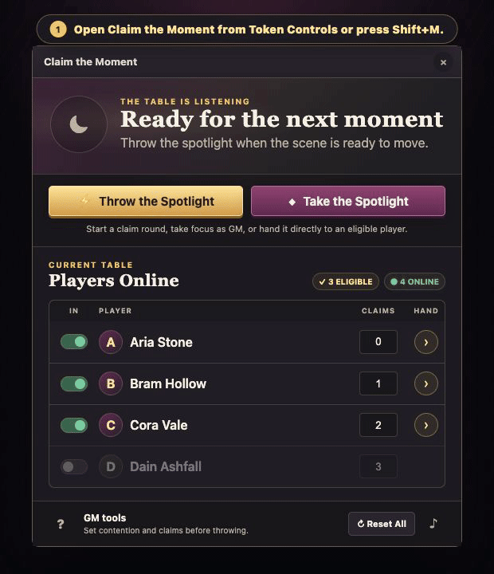
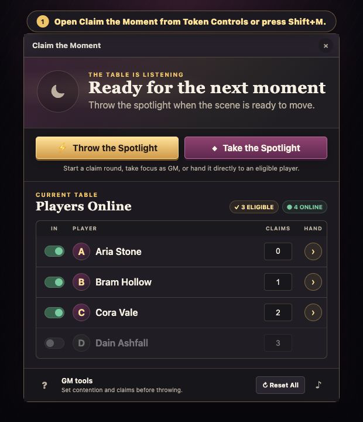
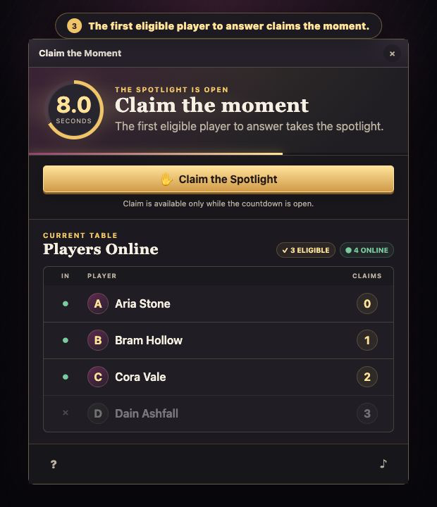

# Claim the Moment

Claim the Moment is a collaborative spotlight manager for the Foundryborne Daggerheart system on Foundry Virtual Tabletop.

This is an independent community project and is not affiliated with or endorsed by Darrington Press, Critical Role, Foundry Gaming, or the Foundryborne team.

The GM throws the spotlight to the table, starting a synchronized countdown. The first eligible player to press **Claim the Spotlight** receives it. If nobody claims before time expires, the module selects an eligible online player with the fewest previous spotlight claims; ties are broken randomly.

> **New to Claim the Moment?** Start with the [player and GM user guide](docs/USER_GUIDE.md) for opening the window, running the spotlight, fairness rules, personal audio, and troubleshooting. The same quick help is always available from the **?** button inside the module window.

## See it in action



### GM and player views





## Features

- A shared window listing every currently online, non-GM player and their spotlight total.
- A GM-only **Throw the Spotlight** control with a configurable 3–60 second countdown.
- A GM-only **Take the Spotlight** control which immediately ends any open countdown and returns focus to the GM.
- A GM-only handoff control on every eligible player which immediately awards them the spotlight.
- First-click wins, with claim processing serialized by one elected GM client to avoid double winners.
- Automatic least-served selection when the countdown expires, with random tie-breaking.
- The player who held the spotlight immediately before a new throw is excluded from that round's automatic fallback, while remaining free to claim manually.
- GM-only contention toggles. Excluded players remain visible but are greyed out for everyone.
- GM-only manual total editing and a confirmed reset-all action.
- Persistent world-level totals and contention choices in one authoritative world setting, including for players who disconnect and return.
- Assigned character names and prototype-token art in the roster and winner display when available.
- A configurable purple skull portrait whenever the GM holds the spotlight.
- Automatic window opening for the GM and eligible connected players whenever a new countdown begins; excluded players are not interrupted.
- Four shared cues: a cinematic BRAAAM when the spotlight is thrown, a heroic horn for player claims, a flourish for automatic selection, and a scary string sting when the GM takes it.
- Independent on/off toggles and Foundry file pickers for replacing each sound.
- A compact per-user volume control in the spotlight window which affects only Claim the Moment and persists in the world.
- A Token Controls button for reopening the window at any time.
- Editable Foundry keybindings: **Shift+M** opens the window and **Shift+C** claims an available spotlight by default.
- Live online/eligible readiness totals with contextual guidance when a throw is unavailable.
- Built-in **?** help plus a per-user welcome message that shows new users exactly where to find the window and can be disabled permanently.

## Compatibility

This release targets and is verified against:

- [Foundry VTT 14.364](https://foundryvtt.com/releases/14.364)
- [Foundryborne Daggerheart 2.5.4](https://github.com/Foundryborne/daggerheart/releases/tag/2.5.4)

The manifest supports Daggerheart 2.5.4 or newer on Foundry VTT generation 14.

## Installation

In Foundry's **Add-on Modules** screen, select **Install Module**, paste this manifest URL, and choose **Install**:

```text
https://github.com/jdip/Claim-The-Moment/releases/latest/download/module.json
```

Enable **Claim the Moment** from **Manage Modules** in a Daggerheart world, then reload the world when prompted.

## Using the module

For the complete player and GM walkthrough, see the **[Claim the Moment User Guide](docs/USER_GUIDE.md)**.

1. Open **Claim the Moment** from the **Claim the Moment** button under Token Controls.
2. The GM checks which online players are in contention and adjusts totals if needed.
3. The GM presses **Throw the Spotlight**, or **Take the Spotlight** to bring focus back immediately.
4. Eligible players press **Claim the Spotlight** before time runs out.
5. The winner's total increments automatically, whether claimed or assigned by the fallback.

The countdown length, all four sound toggles and files, and the GM spotlight icon are available under **Configure Settings → Module Settings → Claim the Moment**. The audio and image fields open Foundry's file picker, where the GM can browse or upload a replacement.

Every user can open the sound control inside the spotlight window to adjust Claim the Moment's volume, including taking it to zero. This preference affects only this module, is stored separately for each user in the current world, and follows that user across browsers and devices.

Only online, non-GM users can claim or be selected automatically. If every eligible player disconnects or is excluded during an open countdown, that round ends without a winner.

## Macro API

The module exposes a small API for macros:

```js
const api = game.modules.get("claim-the-moment").api;
api.open();
api.help();
api.credits();
await api.throwSpotlight(); // GM only
await api.takeSpotlight(); // GM only
await api.handSpotlight("PLAYER_USER_ID"); // GM only
console.log(api.getState());
```

## Development

The module uses browser-native ES modules and has no runtime or build dependencies.

```bash
npm test
npm run check
npm run verify
npm run package
```

The verification command checks syntax, tests, manifest consistency, localization references, attributions, and packaged asset formats. The package command runs those checks before creating the two GitHub release assets expected by the manifest: `dist/module.json` and `dist/claim-the-moment.zip`.

The pure state transitions and service failure paths are covered by Node's built-in test runner. Before release, run the documented [GM and two-player Foundry smoke-test matrix](docs/SMOKE_TEST.md).

The README media is reproducible from [`tools/onboarding-media-preview.html`](tools/onboarding-media-preview.html), which uses the module's shipped stylesheet and current window structure. The listing-ready copy and matching asset references live in [`docs/FOUNDRY_LISTING.md`](docs/FOUNDRY_LISTING.md).

## License

[MIT](LICENSE)

See [ATTRIBUTIONS.md](ATTRIBUTIONS.md) for the bundled artwork and audio sources, creators, licenses, and adaptation details. The same credits are available from **Credits & licenses** at the bottom of the module's Help window.
